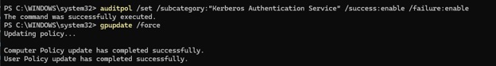
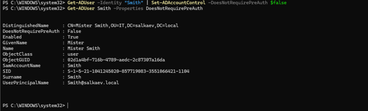
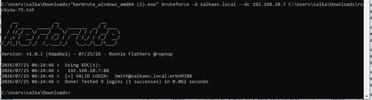
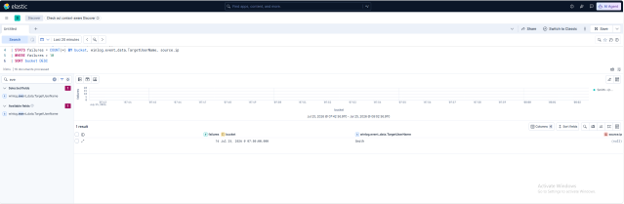

# Kerberos Password Spraying & Brute Force Attack — AD Lab Report

**Lab:** salkaev.local (Windows Server AD Domain Controller)

**Target account:** `Smith` (`Smith@salkaev.local`)

**Tools used:** Auditpol, Active Directory PowerShell Module, Kerbrute v1.0.3, Elastic Security (ES|QL)

---

## Objective

Simulate a Kerberos password brute force attack against an Active Directory domain account in a home lab, enable Kerberos authentication auditing, and build an Elastic ES|QL detection rule capable of identifying Kerberos pre-authentication failures (Event ID 4771).

---

## Background

Kerberos Pre-Authentication is the first step when a user requests a Ticket Granting Ticket (TGT) from the Key Distribution Center (KDC). During a brute force or password spraying attack using Kerberos (e.g., via `Kerbrute`), the attacker submits multiple password guesses directly to port 88 of the Domain Controller.

Failed pre-authentication attempts trigger Windows Security **Event ID 4771** (`Kerberos pre-authentication failed`) on the Domain Controller with failure codes such as `0x18` (Pre-authentication information was invalid / Wrong password). Monitoring these events allows SOC analysts to detect brute force and credential stuffing attempts before account takeover occurs.

---

## Step 1 — Enable Kerberos Audit Policy

To ensure all successful and failed Kerberos authentication events are logged by the Domain Controller, I enabled auditing for the **Kerberos Authentication Service** subcategory and refreshed the system policy.

```powershell
auditpol /set /subcategory:"Kerberos Authentication Service" /success:enable /failure:enable
gpupdate /force
```



**Why this matters**

By default, detailed Kerberos authentication auditing may not capture every failure. Explicitly enabling both `Success` and `Failure` auditing guarantees that Event ID 4771 is written to the Security event log upon every invalid pre-authentication attempt.

---

## Step 2 — Verify Target Account Configuration

Before launching the attack, I verified the target account properties using the Active Directory PowerShell module.

```powershell
Get-ADUser -Identity "Smith" | Set-ADAccountControl -DoesNotRequirePreAuth $false
Get-ADUser Smith -Properties DoesNotRequirePreAuth
```



Account details confirmed:

* **SamAccountName:** `Smith`
* **UserPrincipalName:** `Smith@salkaev.local`
* **DistinguishedName:** `CN=Mister Smith,OU=IT,DC=salkaev,DC=local`
* **DoesNotRequirePreAuth:** `False`

---

## Step 3 — Execute Password Brute Force Attack

I used **Kerbrute v1.0.3** to perform a targeted brute force attack against the domain controller (`192.168.10.7`).

```powershell
.\kerbrute_windows_amd64.exe bruteforce -d salkaev.local --dc 192.168.10.7 rockyou-75.txt
```



Kerbrute tested 9 password candidates in 0.062 seconds against the KDC (port 88) and successfully identified valid credentials:

* **Target User:** `Smith@salkaev.local`
* **Discovered Password:** `erbnMJ88`
* **Result:** `[+] VALID LOGIN: Smith@salkaev.local:erbnMJ88`

---

## Step 4 — Detection in Elastic Security

After executing the attack, I analyzed the ingested Windows event logs in Elastic Security using **ES|QL** to build an automated detection for Kerberos pre-authentication failure spikes.

```sql
FROM winlogbeat-*
| WHERE winlog.event_id == 4771
| EVAL bucket = DATE_TRUNC(5minutes, @timestamp)
| STATS failures = COUNT(*) BY bucket, winlog.event_data.TargetUserName, source.ip
| WHERE failures > 10
| SORT bucket DESC
```



### Query Analysis:

1. **`FROM winlogbeat-*`**: Pulls Windows event logs from the index.
2. **`WHERE winlog.event_id == 4771`**: Filters strictly for Kerberos pre-authentication failure events.
3. **`EVAL bucket = DATE_TRUNC(5minutes, @timestamp)`**: Groups time into 5-minute evaluation windows.
4. **`STATS failures = COUNT(*)...`**: Counts total failures per target user and source IP per time bucket.
5. **`WHERE failures > 10`**: Triggers an alert when more than 10 failed pre-authentication attempts occur within 5 minutes.

### Detection Result:

* **Target User:** `Smith`
* **Failure Count:** `14` failed authentication attempts recorded in a single 5-minute bucket (`Jul 25, 2026 @ 07:05:00.000`).
* **Verdict:** Activity successfully flagged as suspicious credential brute forcing.

---

## Result

The lab successfully demonstrated the full cycle of Kerberos password attack and detection:

* Configured audit policy to log Kerberos pre-authentication events.
* Executed Kerbrute password brute force against `Smith@salkaev.local`.
* Recovered valid credentials (`erbnMJ88`).
* Built an ES|QL detection rule in Elastic Security that successfully identified 14 pre-authentication failures (Event ID 4771) within a 5-minute window.

---

## Detection Recommendations

1. **Threshold & Time Window Adjustments:** Lower the threshold to 5 failures per 5 minutes for high-privilege accounts (Domain Admins).
2. **Include Source IP Tracking:** Include `source.ip` in alert aggregations to detect Password Spraying across multiple accounts originating from a single host.
3. **Account Lockout Policy:** Ensure Active Directory Account Lockout policies are active to lock accounts after a threshold of invalid attempts (e.g., 5-10 invalid attempts within 15 minutes).

---

## Environment

* **Domain:** `salkaev.local`
* **Domain Controller IP:** `192.168.10.7`
* **Attack Tool:** Kerbrute v1.0.3
* **Detection Platform:** Elastic Security (ES|QL)
* All testing was performed exclusively within an isolated Active Directory home lab environment.
```